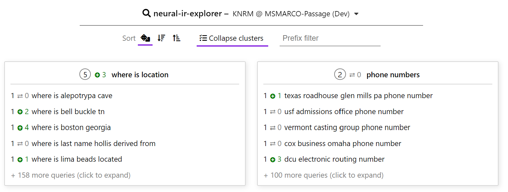
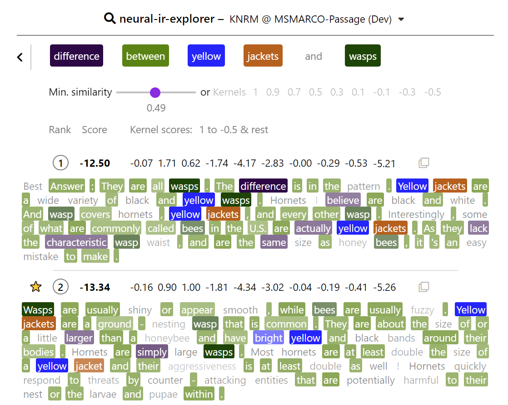
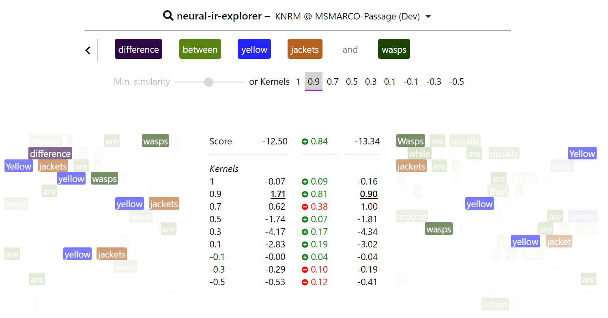

# Neural-IR-Explorer

*Sebastian Hofstätter, Markus Zlabinger and Allan Hanbury
ECIR 2020*

https://arxiv.org/abs/1912.04713

The content-focused Neural-IR-Explorer empowers users to browse through neural re-ranking results and inspect the inner workings and fine-grained results of neural re-ranking models. We aim to explore the reasons behind ranking results.

The explorer includes a categorized overview of the available queries, as well as an individual query result view with various options to highlight semantic connections between query-document pairs.


## Features

Query overview:



Single query result view:



Diff of two documents for a single query:




## Run the web-server

````
set RUN_CONFIG=config_knrm.yaml
set FLASK_APP=api.py
flask run
````

## Run the webpack builder

````
npm run build
````

## Dependency on neural re-ranking results

TODO - We will add a reference to our neural library as soon as it is public
